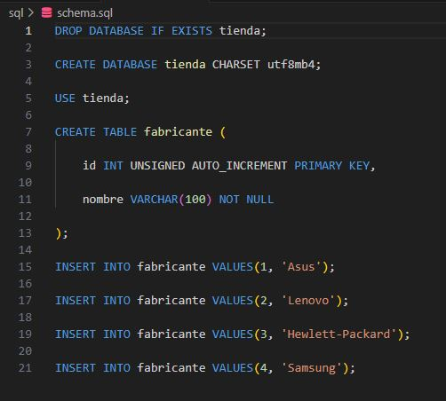

# Actividad1.3.4LampDockers

###  Creamos una imagen de apache `docker build -t lucas/apache:v1 .`  y luego metemos el archivo docker-compose.yml se veria asi

   

###  Creamos el dockerfile

   

###  Ahora creamos los siguientes archivos.   

   
   
   

### Por ultimo ejecutar el contenedor Docker mediante el siguiente comando: docker compose up. Después de ejecutar este comando, abriremos nuestro navegador y podremos visualizar la IP correspondiente. En caso de utilizar el puerto 8080, se debería desplegar PHPMyAdmin, como se muestra a continuación. 

   

